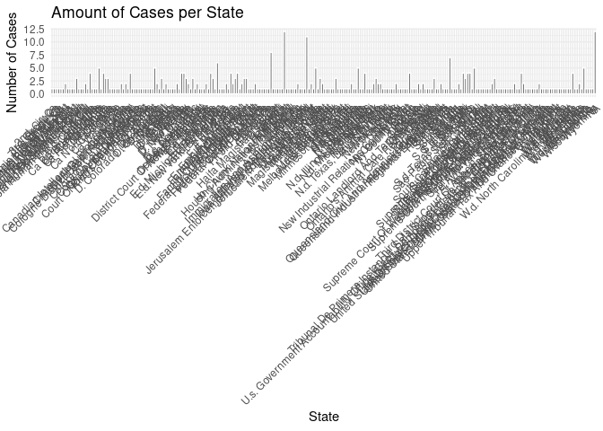
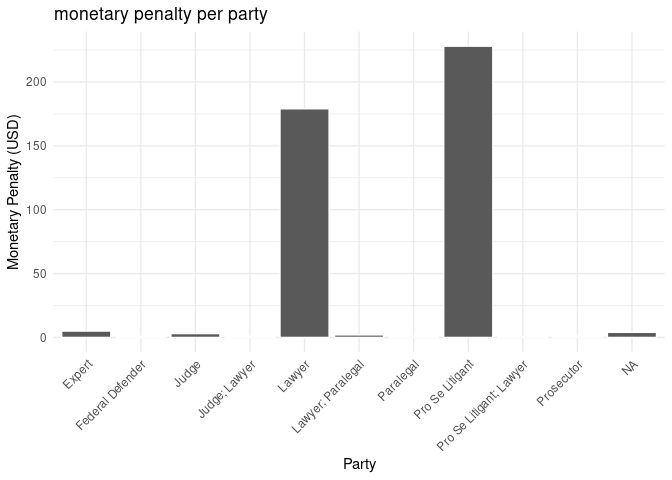
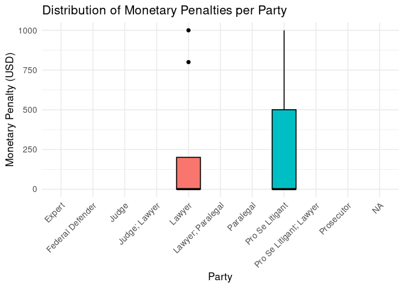

Project proposal
================
AI Hallunication Cases - Yuka, Brynn, & Sasha

``` r
library(tidyverse)
library(broom)
ai_data <- read_csv("../data/Charlotin-hallucination_cases.csv")
#view(ai_data)
```

## 1. Introduction

We found our data set on Kaggle, and it was contributed by a man named
Damien Charlotin. He is a senior research fellow, specifically on
artificial intelligence and the law. He is also a lecturer and
independent practitioner in Paris. The AI hallucinations dataset
contains cases from across the world from 2023 to 2025. The dataset
keeps a record of legal cases in which AI was used and found to be
wrong. Generative AI produced incorrect citations as well as other fake
arguments. The dataset contains the case, the type of hallucination, the
type of AI, the outcome of the case, the monetary penalty, the state,
the time, etc. Our data is set up nicely, where each observation
directly translates to a specific court case that is listed by name. A
LLM refers to a “large language model”. This represents the type of AI
used whether it was chat GPT, Gemini, etc. A hallucination is when one
of these LLMs basically produces an incorrect output or provides the
user with something nonsensical. Our data also includes a variable,
monetary penalty, which lists how much each “error” in a specific LLM is
penalized. The study in which the data was collected is relatively new.
There are currently 426 cases where generative AI has been used,
however, this dataset is still expanding as more come to light. Note
that this study is a work in progress and doesn’t contain all court
cases in which AI was used. It is noted on Kaggle that the data will be
updated annually with new findings. We were mainly interested in when
these cases started emerging, what forms of AI were being used the most,
and how some of our variables like party and hallucination type, affect
monetary penalty.Some of our research questions we want to examine
further are:

1.  Which states come up the most with AI hallucinations?
2.  What LLM is being used the most?
3.  What year did cases start to spike?
4.  What AI hallucinations have a higher monetary penalty?
5.  What effect did the party type have on the outcome and monetary
    penalty within each case?

## 2. Data

**Renaming Variables**

``` r
ai_data <- as_tibble(ai_data) |>
  rename(
`case_name` = `Case Name`,
`state` = `Court`,
`country` = `State(s)`,
`date` = `Date`,
`party` = `Party(ies)`,
`ai_tool` = `AI Tool`,
`hallucination` = `Hallucination`,
`outcome` = `Outcome`,
`monetary_penalty` = `Monetary Penalty`,
`professional_sanction` = `Professional Sanction`,
`key_principle` = `Key Principle`,
`pointer` = `Pointer`,
`source` = `Source`,
`details` = `Details`
)
```

**Data Cleanup**

Since we have very little numerical data, we need to first clean up our
dataset before we visualize. We focused specifically on cleaning the
variables we are analyzing: court, location, ai_tool, hallucination,
outcome, monetary_penalty.

First, we removed all extra spaces, standardized the capitalization, and
converted all empty observations to NA for all of our variables of
interest. Next, we did the same focusing specifically on ai_tool,
splitting rows based on common separators such as slashes, colons, and
commas. After tidying these data, we accounted for synonyms, and finally
did a wordcount for each of the tools mentioned. Then, we focused
specifically on monetary_penalty, and removed all non-numeric
characters, replaced any text indicative of a missing value with NA, and
turned the numbers into an actual number type. Finally, for the
variables hallucination, outcome, and professional_sanction, we used
keywords to group text (ignoring capitalization) and replace it with a
standard word or phrase.

``` r
ai_data <- ai_data |>
  mutate(
    across(
      c(state, country, hallucination, outcome, monetary_penalty, professional_sanction),
      ~ .x |> str_squish() |> str_to_title() |> na_if("")
    )
  )

rates <- tibble::tribble(
  ~currency, ~rate_to_usd,
  "USD", 1,
  "EUR", 1.07,
  "GBP", 1.24,
  "CAD", 0.73
)

ai_data <- ai_data %>% 
  mutate(currency = "USD")


monetary_penalty_tidy <- ai_data %>%
  mutate(
    monetary_penalty = str_replace_all(monetary_penalty, "[$,]", ""),
    monetary_penalty = na_if(monetary_penalty, "none"),
    monetary_penalty = na_if(monetary_penalty, "n/a"),
    monetary_penalty = na_if(monetary_penalty, "na"),
    monetary_penalty = na_if(monetary_penalty, "N/A"),
    monetary_penalty = as.numeric(monetary_penalty)
  )
```

    ## Warning: There was 1 warning in `mutate()`.
    ## ℹ In argument: `monetary_penalty = as.numeric(monetary_penalty)`.
    ## Caused by warning:
    ## ! NAs introduced by coercion

``` r
monetary_penalty_usd <- monetary_penalty_tidy %>%
  mutate(
    monetary_penalty_usd = if_else(str_to_upper(currency) == "USD",
                                   monetary_penalty,
                                   NA_real_)
  )
```

``` r
ai_tool_tidy <- ai_data |>
  mutate(ai_tool = str_replace_all(ai_tool, " and | & ", ",")) |>
  separate_rows(ai_tool, sep = ",|/|;") |>
  mutate(ai_tool = str_squish(ai_tool),
         ai_tool = na_if(ai_tool, ""),
         ai_tool = if_else(str_to_lower(ai_tool) %in% c("n/a","na","none"), NA_character_, ai_tool)) |>
  drop_na(ai_tool)
```

``` r
synonyms <- c(
  "ChatGPT" = "OpenAI ChatGPT",
  "GPT-4" = "OpenAI ChatGPT",
  "GPT4" = "OpenAI ChatGPT",
  "Google Gemini" = "Gemini",
  "Google Bard" = "Gemini",
  "Bard" = "Gemini",
  "Claude" = "Anthropic Claude",
  "implied" = "Implied",
  "Copilot" = "MS Copilot",
  "Microsoft CoPilot" = "MS Copilot",
  "CoPilot" = "MS Copilot"
)
ai_tool_tidy <- ai_tool_tidy |>
  mutate(ai_tool = coalesce(synonyms[ai_tool], ai_tool))
```

``` r
word_counts <- ai_tool_tidy |>
  count(ai_tool, name = "freq", sort = TRUE)
```

``` r
ai_data <- ai_data |>
  mutate(
    hallucination = case_when(
      str_detect(coalesce(hallucination, ""), regex("Miscited|Case Cited|citation|Cittions", ignore_case = TRUE)) ~ "Fake Citation",
      str_detect(coalesce(hallucination, ""), regex("Chatgpt-Generated|Irrelevant Info|Paragraph|argument|Authority",  ignore_case = TRUE)) ~ "Fake Argument",
      str_detect(coalesce(hallucination, ""), regex("Inaccuracies|Quotation|Quotations|References|quote|source|evidentiary|evidence", ignore_case = TRUE)) ~ "Fake Source/Quote",
      str_detect(coalesce(hallucination, ""), regex("Non-Existent Legal|Wrong Legal|Caselaw|case law", ignore_case = TRUE)) ~ "Fabricated Case Law",
      str_detect(coalesce(hallucination, ""), regex("norm", ignore_case = TRUE)) ~ "Fabricated Norm",
      str_detect(coalesce(hallucination, ""), regex("Fake/Incorrect|Nonexistent Cases|Non-Existent Israeli|Irrelevant Cases|Fake Legal Case|Fictitious Cases|Non-Existent Case|Or Misrepresented Cases|Non-Existent Cases|Fabricated Cases|Fake Cases|Fake Case|Fake/Flawed Cases|Fictitious Court", ignore_case = TRUE)) ~ "Fabricated Case",
      str_detect(coalesce(hallucination, ""), regex("Misrepresented Facts|Precedent", ignore_case = TRUE)) ~ "Misrepresented Fact / Precedent",
      str_detect(coalesce(hallucination, ""), regex("Legal Authorities|Fictitious Authorities|Tribunal|Outdated Advice|Fictitious Legal|Court Decisions|Misattributed Court Decisions|Fictitious Court|Fictitious Judgement|Legal Judgments|Judgements", ignore_case = TRUE)) ~ "False Legal Judgments",
      str_detect(coalesce(hallucination, ""), regex("Suspicious|Unverifiable|Allegations|Pseudolegal|None", ignore_case = TRUE)) ~ "Unable to Conclude AI-Generated Content",
      str_detect(coalesce(hallucination, ""), regex("Fabricated Attribution", ignore_case = TRUE)) ~ "Fabricated Attribution",
      str_detect(coalesce(hallucination, ""), regex("Appeal", ignore_case = TRUE)) ~ "Fake Appeal Brief",
      TRUE ~ hallucination
    )
    
  )
ai_data <- ai_data |>
  mutate(
    outcome = case_when(
      str_detect(outcome, regex("dismissed|thrown out", ignore_case = TRUE)) ~ "Dismissed",
      str_detect(outcome, regex("pending|ongoing", ignore_case = TRUE)) ~ "Pending",
      str_detect(outcome, regex("fined|sanction|penalty", ignore_case = TRUE)) ~ "Penalized",
      TRUE ~ outcome
    )
  )
ai_data <- ai_data |>
  mutate(
    professional_sanction = case_when(
      str_detect(professional_sanction, regex("yes|y", ignore_case = TRUE)) ~ "Yes",
      str_detect(professional_sanction, regex("no|n", ignore_case = TRUE)) ~ "No",
      TRUE ~ professional_sanction
    )
  )
```

``` r
print(dim(ai_data))
```

    ## [1] 426  15

``` r
print(glimpse(ai_data))
```

    ## Rows: 426
    ## Columns: 15
    ## $ case_name             <chr> "The People v. Raziel Ruiz Alvarez", "In the Int…
    ## $ state                 <chr> "Ca California", "Ca Iowa", "Ca California", "D.…
    ## $ country               <chr> "Usa", "Usa", "Usa", "Usa", "Usa", "Usa", "Singa…
    ## $ date                  <date> 2025-10-02, 2025-10-01, 2025-09-30, 2025-09-30,…
    ## $ party                 <chr> "Lawyer", "Lawyer", "Pro Se Litigant", "Expert",…
    ## $ ai_tool               <chr> "Unidentified", "Unidentified", "Implied", "Chat…
    ## $ hallucination         <chr> "Fake Citation", "Fake Citation", "Fake Citation…
    ## $ outcome               <chr> "Penalized", "Penalized", "Warning", "Dismissed"…
    ## $ monetary_penalty      <chr> "1500 Usd", "150 Usd", NA, NA, NA, NA, "800", NA…
    ## $ professional_sanction <chr> "Yes", "Yes", "No", "No", "No", "No", "No", "No"…
    ## $ key_principle         <chr> NA, NA, NA, NA, NA, NA, NA, NA, NA, NA, NA, NA, …
    ## $ pointer               <chr> "Volokh", NA, NA, NA, NA, NA, NA, NA, NA, NA, "V…
    ## $ source                <chr> "https://reason.com/volokh/2025/10/04/court-espe…
    ## $ details               <chr> "\"When criminal defense attorneys fail to compl…
    ## $ currency              <chr> "USD", "USD", "USD", "USD", "USD", "USD", "USD",…
    ## # A tibble: 426 × 15
    ##    case_name        state country date       party ai_tool hallucination outcome
    ##    <chr>            <chr> <chr>   <date>     <chr> <chr>   <chr>         <chr>  
    ##  1 The People v. R… Ca C… Usa     2025-10-02 Lawy… Uniden… Fake Citation Penali…
    ##  2 In the Interest… Ca I… Usa     2025-10-01 Lawy… Uniden… Fake Citation Penali…
    ##  3 In re the Marri… Ca C… Usa     2025-09-30 Pro … Implied Fake Citation Warning
    ##  4 Khoury et al v.… D. U… Usa     2025-09-30 Expe… ChatGPT Fake Source/… Dismis…
    ##  5 Tomlin v. State… D. N… Usa     2025-09-30 Pro … Implied Fake Citation Warning
    ##  6 Munoz v. Lopez   Ca C… Usa     2025-09-29 Pro … Implied Fake Citation Warning
    ##  7 Tajudin bin Gul… High… Singap… 2025-09-29 Lawy… Uniden… Fake Citation Costs …
    ##  8 Chapter Kris Ja… N.d.… Usa     2025-09-29 Pro … Implied Fake Citation Show C…
    ##  9 Jade Riley Burc… D. N… Usa     2025-09-26 Pro … Uniden… Fake Citation Warning
    ## 10 Reddy v Saroya   Ca A… Canada  2025-09-26 Lawy… Implied Fake Citation <NA>   
    ## # ℹ 416 more rows
    ## # ℹ 7 more variables: monetary_penalty <chr>, professional_sanction <chr>,
    ## #   key_principle <chr>, pointer <chr>, source <chr>, details <chr>,
    ## #   currency <chr>

``` r
print(spec(ai_data))
```

    ## NULL

## 3. Data analysis plan

- What variables will you visualize to explore your research questions?

court -\> We will explore whether or not any patterns arise between the
specific court and the severity of the punishment, or rather if there
are certain courts that try more ai hallucination cases than others

location -\> We will observe if there is any relationship between
location and the frequency of cases

ai_tool -\> Do certain ai tools/softwares appear in these cases more
often? Are certain awarded larger penalties?

hallucination -\> What were the most common hallucinations in these
cases? Were there specific ai tools that were ore often responsible for
certain hallucinations?

outcome -\> What were the most common outcomes for these cases, and do
they vary by location, ai tool used, court tries in, or the specific
hallucination?

monetary_penatly -\> What was the range of monetary penalties for these
cases? What is considered on the high end and what hallucinations led to
these penalties?

professional_sanction -\> What is the relationship between monetary
penalty and whether or not professional disciplinary action was taken
against the party involved?

- Will there be any other data that you need to find to help with your
  research question?

As of now, we don’t think so. However, we might need to find other data
as we explore our research questions further.

## 3. Preliminary Visualizations

**Summary Statistics**

``` r
summary(ai_data$monetary_penalty)
```

    ##    Length     Class      Mode 
    ##       426 character character

**Preliminary Visualization**

``` r
ai_data$monetary_penalty <- as.numeric(ai_data$monetary_penalty)
```

    ## Warning: NAs introduced by coercion

``` r
word_counts <- ai_data |>
  count(ai_tool, sort = TRUE)

ggplot(ai_data, aes(x = monetary_penalty)) +
  geom_histogram(bins = 30, fill = "red", color = "white") +
  labs(
    title = "Distribution of Monetary Penalties",
    x = "Penalty Amount (USD)",
    y = "Number of Cases"
  ) +
  theme_minimal()
```

    ## Warning: Removed 415 rows containing non-finite outside the scale range
    ## (`stat_bin()`).

<!-- -->

``` r
ai_data |>
  count(state, sort = TRUE) |>
  slice_max(n, n = 10) |>
  ggplot(aes(x = reorder(state, n), y = n)) +
  geom_col(fill = "pink") +
  coord_flip() +
  labs(title = "Top 10 States by Number of AI Hallucination Cases",
       x = "State", y = "Number of Cases") +
  theme_minimal()
```

<!-- -->

``` r
ggplot(ai_data, aes(x = state, fill = monetary_penalty)) +
  geom_bar(color = "white") +
  labs(
    title = "Amount of Cases per State",
    x = "State",
    y = "Number of Cases", 
    fill = "Penalty Amount (USD)"
  ) +
  theme_minimal() +
  theme(axis.text.x = element_text(angle = 45, hjust = 1))
```

    ## Warning: The following aesthetics were dropped during statistical transformation: fill.
    ## ℹ This can happen when ggplot fails to infer the correct grouping structure in
    ##   the data.
    ## ℹ Did you forget to specify a `group` aesthetic or to convert a numerical
    ##   variable into a factor?

<!-- -->

``` r
ggplot(ai_data, aes(x = party, fill = monetary_penalty)) +
  geom_bar(color = "white") +
  labs(
    title = "monetary penalty per party",
    x = "Party",
    y = "Monetary Penalty (USD)", 
    fill = "Penalty Amount (USD)"
  ) +
  theme_minimal() +
  theme(axis.text.x = element_text(angle = 45, hjust = 1))
```

    ## Warning: The following aesthetics were dropped during statistical transformation: fill.
    ## ℹ This can happen when ggplot fails to infer the correct grouping structure in
    ##   the data.
    ## ℹ Did you forget to specify a `group` aesthetic or to convert a numerical
    ##   variable into a factor?

<!-- -->

``` r
ggplot(ai_data, aes(x = party, y = monetary_penalty, fill = party)) +
  geom_boxplot(color = "black") +
  labs(
    title = "Distribution of Monetary Penalties per Party",
    x = "Party",
    y = "Monetary Penalty (USD)",
    fill = "Party"
  ) +
  theme_minimal(base_size = 13) +
  theme(
    axis.text.x = element_text(angle = 45, hjust = 1),
    legend.position = "none"
  )
```

    ## Warning: Removed 415 rows containing non-finite outside the scale range
    ## (`stat_boxplot()`).

<!-- -->
